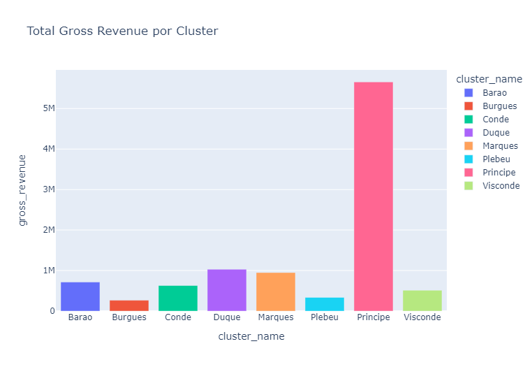
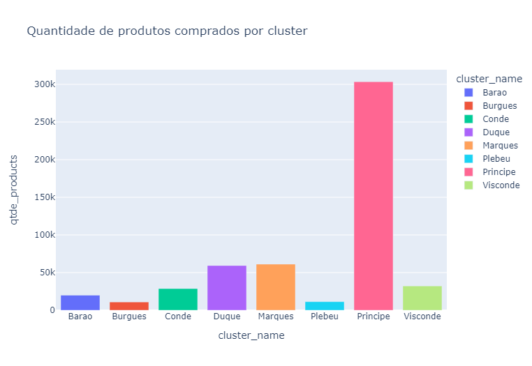
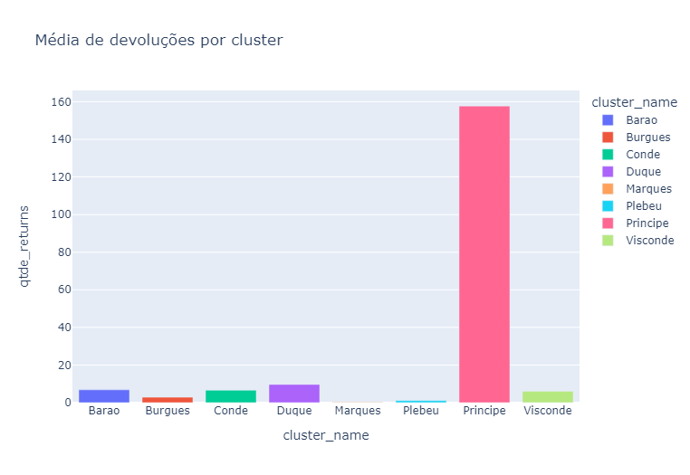
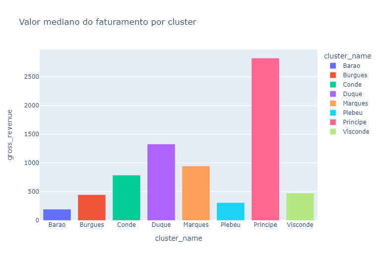
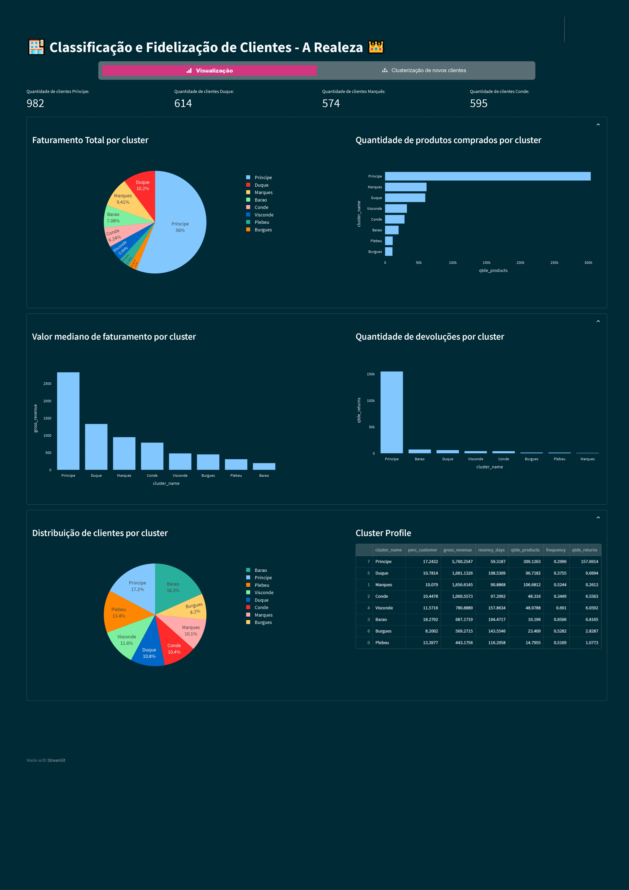
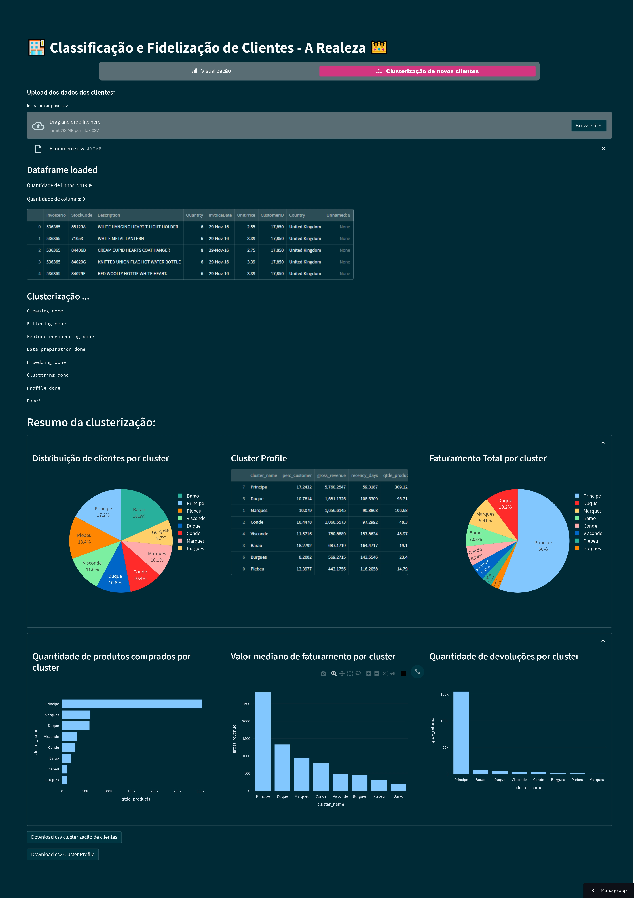

# Programa A Realeza - Fidelização de Clientes 

## O principal objetivo desse projeto é identificar clientes com características similares e classificá-los dentro de uma hierarquia. Dessa maneira, o nível de importância do cliente para a empresa é definido a partir de diferentes parâmetros fornecendo informações úteis para tomada de decisão de outras áreas da empresa, como marketing e negócios.

#### Esse projeto foi realizado por Ana Camila Mamede (anacamilamamede@gmail.com).

# Contexto

Os dados analisados são de uma empresa fictícia que comercializa produtos de segunda linha de diversas marcas a um preço reduzido, através de um e-commerce. Em pouco mais de um ano de operação, o time de marketing percebeu que alguns clientes da sua base compram produtos mais caros, com certa frequência e acabam contribuindo com uma parcela significativa do faturamento da empresa.

Dessa maneira, o time de marketing pretende lançar um programa de fidelidade para os melhores clientes da base, chamados Príncipes. No entanto, o time não tem conhecimento avançado em análise e manipulação de dados para eleger os participantes do programa e essa atividade foi repassada para o time de dados. 

# 1. Questão de negócio
Em resumo, a questão de negócio é: selecionar os mais valiosos clientes para formar o programa de fidelidade "A REALEZA", em especial definir o grupo de clientes "Príncipes".

O resultado será a lista de clientes da empresa classificados em diferentes níveis hierárquicos, de acordo com a sua importância dentro da monarquia do e-commerce. Com essa lista, o time de marketing fará uma sequência de ações personalizadas e exclusivas para o grupo, visando aumentar o faturamento e a frequência de compra. Juntamente com a lista, deve ser enviado um relatório com as seguintes questões respondidas:

    1. Quem são as pessoas elegíveis para participar do programa de Insiders ?
    2. Quantos clientes farão parte do grupo?
    3. Quais as principais características desses clientes ?
    4. Qual a porcentagem de contribuição do faturamento, vinda do Insiders ?
    5. Qual a expectativa de faturamento desse grupo para os próximos meses ?
    6. Quais as condições para uma pessoa ser elegível ao Insiders ?
    7. Quais as condições para uma pessoa ser removida do Insiders ?
    8. Qual a garantia que o programa Insiders é melhor que o restante da base ?
    9. Quais ações o time de marketing pode realizar para aumentar o faturamento?

## Descrição dos dados

Para realizar esse projeto estão disponíveis as faturas geradas por cada compra, itens, quantidades e preços dos produtos. Os dados são referentes a compras realizadas no e-commerce durante o período de um ano (Nov 2015 - Dez 2017).

| Atributo    | Descrição                                                                  |
|-------------|----------------------------------------------------------------------------|
| InvoiceNo   | Identificador único de cada transação                                      |
| StockCode   | Código de estoque único referente ao produto comprado                      |
| Description | Descrição do produto ofertado                                              |
| Quantity    | Quantidade de itens comprados (ou devolvidos em caso de valores negativos) |
| InvoiceDate | Data da emissão da fatura                                                  |
| UnitPrice   | Preço unitário do produto                                                  |
| CustomerID  | Identificar único do cliente                                               |
| Country     | País onde a compra foi realizada                                           |

# 2. Premissas de negócio
- Alguns clientes foram desconsiderados para criação dos agrupamentos por apresentarem comportamento não desejável (por exemplo, retornar todos os itens comprados)
- Produtos com preço unitário menor que £0,04 foram considerados brindes, e não foram somados ao faturamento gerado.
- Códigos de estoque referentes a processos de postagem e taxas foram desconsiderados.

# 3. Planejamento da solução
O planejamento da solução foi divido em três etapas:
- Produto Final
- Processo
- Ferramentas

## Produto Final 
O produto final será uma lista com os clientes agrupados e um relatório com as respostas para as perguntas do time de negócio. Além disso, será gerado um modelo para a classificação dos clientes, que deverá ser executado periodicamente para classificar os novos clientes do e-commerce. Dessa maneira, foi criado uma aplicação web na qual o usuário pode visualizar os dados da classificação atual e inserir novos clientes através do upload do csv do banco de dados do e-commerce.

## Processo
**Entendendo o problema de negócio**

Entender a necessidade de agrupamento dos clientes para auxiliar a tomada de decisão das próximas etapas.

**Coleta e limpeza dos dados**

Coleta dos dados e limpeza dos dados, como renomear colunas, verificar tipos de dados, verificar a existência de NA e decidir o que fazer com eles. Filtragem das variáveis após a análise inicial.

**Feature Engineering**

Criação de features que descrevem corretamente o fenômeno, para utilização como parâmetros de entrada no treinamento dos modelos de machine learning.

**Análise Exploratória dos Dados (EDA)**

Exploração dos dados disponíveis para adquirir conhecimento do negócio e do problema a ser resolvido, analisar valores inconsistesntes, comportamento dos dados e outliers.

**Preparação dos dados e Estudo de Espaço**

Uso de técnicas de redimensionamento dos dados para uso nas etapas de estudo do espaço e treinamento dos modelos de machine learning. Para o estudo do espaço, foram utilizados os seguintes métodos para a redução de dimensionalidade: PCA (Principal Component Analysis), UMAP (Uniform Manifold Approximation and Projection), t-SNE (t-Distributed Stochastic Neighbor Embedding) e Tree-Based Embedding.

**Feature Selection**

Seleção de variáveis que serão utilizados no treinamento dos modelos.

**Machine Learning Modelling**

Utilização de técnicas de machine learning para treinamento de modelos de clusterização. Os algoritmos K-Means Clustering, GMM (Gaussian Mixture Models) Clustering e Hierarchical Clustering foram treinados com diferentes números de cluster e a métrica avaliada foi a _Silhouette Score_. 

**Final Machine Learning Modelling**

Baseado na performance do modelo, escolheu-se o modelo final e a quantidade de clusters. 

**Análise Exploratória dos Clusters**

Análise Exploratória do agrupamento de clientes resultante do modelo final, e utilização dos dados para responder as perguntas do time de marketing.

**Deploy do Modelo**

- Relatório com os resultados obtidos
- Modelo em produção para a classificação de novos clientes
- Aplicação web para visualização dos dados dos clientes clusterizados e classificação de novos clientes.

## Ferramentas
- Python 3.9.13
- Pandas, Seaboarn, Matplotlib, Skelear, Pandas Profiling
- Git
- Técnicas de redução de dimensionamento: PCA, t-SNE e UMAP,Random Forest
- Algoritmos de Clusterização: K-Means, Gaussian Mixture Model, Hierarchical Clustering e DBSCAN
- Métrica de performance: Silhouette Score
- Streamlit

# 4. Resultados de negócio
Com os clusters formados os seguintes insights foram gerados:

**O faturamento dos clientes do cluster Príncipe corresponde a 55.98% do total.**

**Os clientes do cluster Príncipe possuem um volume de produtos de 57.56% do total.**

**Os clientes do cluster Príncipe possuem média de devolução acima da média geral.**

**A mediana dos clientes do cluster Príncipe é 2826.31 enquanto a mediana da base é 613.20, ou seja 4.61x maior.**

# 6. Deploy do modelo
Para deploy do modelo foi utilizado a biblioteca Streamlit para criar uma página web, nela pode-se visualizar os dados dos classificação atual dos clientes e, em uma segunda página, inserir novos clientes através do upload do csv do banco de dados do e-commerce.

# 7. Conclusões
O principal objetivo desse projeto foi alcançado, a base de dados de clientes do e-commerce foi agrupada em 8 grupos de clientes com características diferentes, como pode ser observado na análise exploratória de dados dos clientes clusterizados. Os times de marketing e negócio consegue gerar insights e estratégias para a fidelização desses clientes. Além disso, esses times conseguem classificar novos clientes inserindo uma nova planilha de dados na página web. 

# 8. Próximos passos
- Criar novas features para melhorar o modelo e trazer novos insights.
- Obter mais dados sobre os clientes.
- Criar novas variáveis na etapa de Feature Engineering, melhorando o modelo final.
- Automatizar o processo de treinamento do modelo de machine learning da clusterização, para que o modelo seja atualizado após um intervalo de tempo, atualizando a classificação e a quantidade de clientes nos clusters.

